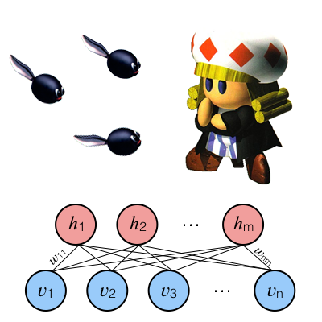

# RBM Toadofsky



Toadofsky is a minor character in the classic SNES role-playing game, [Super Mario RPG](https://en.wikipedia.org/wiki/Super_Mario_RPG).  He is a composer that is constantly having trouble coming up with inspiration for new music.

RBM Toadofsky is a python program named after this fictional composer that trains and uses a neural network to generate novel MIDIs after training on a dataset of provided MIDI files.  Such a tool would have been invaluable to the fictional Toadofsky!

A [restricted Boltzmann machine (RBM)](https://en.wikipedia.org/wiki/Restricted_Boltzmann_machine) is used to generate short MIDI sequences.  An RBM is a neural network with two layers: one visible and one hidden.  Each visible node is reciprocally connected with each hidden node with no visible-visible or hidden-hidden connections.  Each visible node takes MIDI data at a given time, multiplies by a weight, and then outputs to the hidden layer.  [Gibbs sampling](https://en.wikipedia.org/wiki/Gibbs_sampling) of this RBM is used for MIDI generation.

Included here are two networks trained on some interesting datasets: the entire [VGMusic](https://www.vgmusic.com/) piano MIDI database and midis of [Chopin's](https://en.wikipedia.org/wiki/Fr%C3%A9d%C3%A9ric_Chopin) Mazurkas.

## Dependencies

  * [TensorFlow](https://www.tensorflow.org/)
  * [pandas](https://pandas.pydata.org/)
  * [numpy](http://www.numpy.org/)
  * [mido](https://github.com/mido/mido)
  * [tqdm](https://github.com/tqdm/tqdm)

You can use [pip](https://pypi.python.org/pypi/pip) to install any missing dependencies.

## Basic Usage

First, a model must be trained on your dataset of interest.  Here, I've provided a MIDI dataset consisting of Chopin's Mazurkas.  I've also provided models that are already trained on this set of data as well as one trained on all the piano MIDIs available on [VGMusic.com](http://vgmusic.com)!  These models are named chopin and todofsky, respectively.

The training file, <b>toadofsky_train.py</b>, contains several user-editable variables that should be changed to fine tune your model.  A new model can be trained by specifying which directory contains your training midis (the MIDIDIR variable) and running:

```
python toadofsky_train.py
```

The music generating script, <b>toadofsky.py</b>, also contains several user-editable variables.  These include variables that change the MIDI instrument, timing, and musical structure.  A saved model can be used for MIDI generation by specifying which model to use (the MODELDIR and MODEL variables) followed by running:

```
python toadofsky.py
```

To get music that sounds pleasing, remember that you may have to fiddle around with both training and generation variables.  

## Acknowledgements

This project was inspired by and conceptually based on [dshieble's](https://github.com/dshieble/Music_RNN_RBM) neural network music generator which was, in turn, based on [Boulanger-Lewandowski et al. (2012)](https://arxiv.org/abs/1206.6392)
